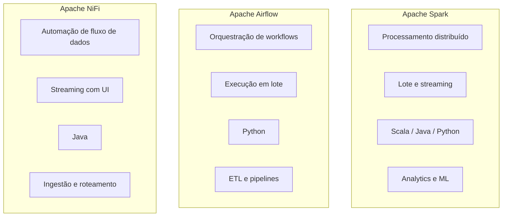

**Plano de curso de Introdução a Engenharia de Dados**

* FACET-SNP-317 - INTRODUÇÃO À ENGENHARIA DE DADOS - T01 (2025.2 - 4N123)

- [:game\_die: 1. Turma: Introdução a Engenharia de Dados](#game_die-1-turma-introdução-a-engenharia-de-dados)
  - [:watch: 1.1. Carga Horária Total: 60](#watch-11-carga-horária-total-60)
  - [Sala C7](#sala-c7)
  - [:hourglass\_flowing\_sand: 1.2. Horário: 19hs - 22hs](#hourglass_flowing_sand-12-horário-19hs---22hs)
  - [:page\_with\_curl: 1.3. Ementa](#page_with_curl-13-ementa)
  - [:page\_with\_curl: 1.4. Metodologia](#page_with_curl-14-metodologia)
  - [:page\_with\_curl: 1.5. Procedimentos de avaliação de aprendizagem](#page_with_curl-15-procedimentos-de-avaliação-de-aprendizagem)
  - [:hourglass\_flowing\_sand: 1.6. Horário de atendimento](#hourglass_flowing_sand-16-horário-de-atendimento)
- [:globe\_with\_meridians: 2. Sites utilizados](#globe_with_meridians-2-sites-utilizados)
- [:abacus: 3. Repositórios de apoio](#abacus-3-repositórios-de-apoio)
- [:date: 4. Datas de aulas e conteúdo](#date-4-datas-de-aulas-e-conteúdo)
- [:date: 5. Datas de avaliações](#date-5-datas-de-avaliações)
- [:hammer\_and\_wrench: 6. Ferramentas](#hammer_and_wrench-6-ferramentas)
- [:books: 7. Livros (básicos)](#books-7-livros-básicos)
- [:newspaper: 8. Artigos (referências bibliográficas complementares)](#newspaper-8-artigos-referências-bibliográficas-complementares)
  - [:books: 8.1. Outras referências complementares](#books-81-outras-referências-complementares)
- [:notebook: 9. Cursos gratuítos (opcionais)](#notebook-9-cursos-gratuítos-opcionais)
  - [:notebook:  9.1. Cursos sobre BI com Scriptcase](#notebook--91-cursos-sobre-bi-com-scriptcase)
- [:green\_book: 10. Como estudar (dicas)](#green_book-10-como-estudar-dicas)
- [:family\_man\_woman\_girl\_boy:  11. Grupos no telegram](#family_man_woman_girl_boy--11-grupos-no-telegram)
- [:tv: 12. Videos recomendados (material opcional)](#tv-12-videos-recomendados-material-opcional)
- [:office: 13. Projetos da fundação Apache e suas características](#office-13-projetos-da-fundação-apache-e-suas-características)
- [:alarm\_clock: 14. Carga horária de 15hs adicionais (remota/online)](#alarm_clock-14-carga-horária-de-15hs-adicionais-remotaonline)
  - [🎓 14.1. Playlist de Introdução à Engenharia de Dados (até 15h)](#-141-playlist-de-introdução-à-engenharia-de-dados-até-15h)
  - [📺 14.2. Playlist: Fundamentos de Engenharia de Dados (14h)](#-142-playlist-fundamentos-de-engenharia-de-dados-14h)
    - [🎓 14.2.1 Introdução à Engenharia de Dados](#-1421-introdução-à-engenharia-de-dados)
    - [🧩 14.2.2. Modelagem de Dados](#-1422-modelagem-de-dados)
    - [🔄 14.2.3. ETL (Extract, Transform, Load)](#-1423-etl-extract-transform-load)
    - [🏢 14.2.4. Data Warehouse](#-1424-data-warehouse)
    - [🌊 14.2.5. Data Lake](#-1425-data-lake)
    - [🧪 14.2.6. Pipelines de Dados](#-1426-pipelines-de-dados)
    - [🔐 14.2.7. Governança de Dados](#-1427-governança-de-dados)
    - [📊 14.2.8. Big Data](#-1428-big-data)
  - [📄 14.3. Artigos Científicos Open Access sobre Engenharia de Dados](#-143-artigos-científicos-open-access-sobre-engenharia-de-dados)
- [📄 15. Exemplos usados em sala de aula](#-15-exemplos-usados-em-sala-de-aula)
- [📄 16. Assuntos diversos](#-16-assuntos-diversos)
- [💻 Ícones usados nesta página](#-ícones-usados-nesta-página)

---
## :game_die: 1. Turma: Introdução a Engenharia de Dados

### :watch: 1.1. Carga Horária Total: 60

### Sala C7

### :hourglass_flowing_sand: 1.2. Horário: 19hs - 22hs

### :page_with_curl: 1.3. Ementa

* Data Warehouse: fundamentos, técnicas e ferramentas. 
* Conceitos, técnicas e aplicações de Big data. 
* Conceitos de coleta e técnicas de Mineração de dados.

### :page_with_curl: 1.4. Metodologia

A disciplina será conduzida por meio de aulas expositivas e dialogadas, com apresentação estruturada de conceitos teóricos e práticos, incentivando a participação ativa dos estudantes por meio de questionamentos, discussões orientadas e resolução de exemplos aplicados.

Serão utilizados comentários e análises de casos reais, situações práticas e exemplos relacionados ao contexto profissional, incluindo a apresentação e discussão de produtos, ferramentas e tecnologias correlatas aos temas abordados na disciplina, visando aproximar o conteúdo acadêmico da realidade do mercado e da pesquisa aplicada.

As atividades poderão envolver demonstrações práticas, análise de materiais complementares e discussões coletivas, buscando consolidar a compreensão conceitual e o desenvolvimento do raciocínio crítico.

As aulas complementares, reposições ou atividades remotas (EaD) serão realizadas por meio de conteúdos disponibilizados na plataforma SIGAA e nos ambientes digitais da disciplina, incluindo leituras orientadas, vídeos, exercícios e atividades práticas, constituindo parte integrante do processo de aprendizagem. Os alunos devem como parte da carga horária EAD: trazer ferramentas e datasets previamente baixados e instalados.

[Retornar ao Sumário](#sumário)

### :page_with_curl: 1.5. Procedimentos de avaliação de aprendizagem

Prova presencial escrita objetiva de múltipla escolha. Cálculo de notas por soma de pontos simples. Cada avaliação vale 10 pontos. São 3 avaliações. Resultado final via média simples entre avaliações. Excepcionalmente poderão ocorrer avaliações online. Poderão ocorrer atividades online objetivando fixação de conceitos (valendo pontos ou não).

 

Provas de 2ª chamada devem ser requisitas dentro do prazo e formalmente conforme regras da faculdade. A prova de 2ª chamada é discursiva, escrita (tipo canetão).

 

A [carga horária remota/EAD] será realizada via: a) leitura de artigos postados pelo professor (ou videos correlatos aos assuntos abordados em sala); b) exercícios disponíveis na plataforma EaD da instituição ou c) envio de trabalho, conforme o caso. Este material também poderá estar na sua avaliação presencial escrita. O material usado nas atividades EAD será disponibilizado no site do professor e na página da disciplina no SIGAA e no github.

 

A 1ª avaliação terá o conteúdo das aulas de 1 a 5.

A 2ª avaliação terá o conteúdo das aulas 6 a 10.

A 3ª avaliação terá o conteúdo das aulas 11 a 14 e os artigos selecionados.

 

Temos 15 encontros presenciais, sequênciais, 1 ves por semana; nos encontros 5, 10 e 15, teremos as avaliações.

Carga Horária Remota (EAD):

 

A carga horária remota (15 horas) será desenvolvida por meio de atividades orientadas de aprendizagem assíncrona, complementares às aulas presenciais, com o objetivo de aprofundar conceitos, promover autonomia acadêmica e preparar o estudante para as avaliações da disciplina.

 

As atividades EAD deverão ser realizadas pelos alunos ao longo do semestre, conforme cronograma disponibilizado pelo professor, podendo incluir:

 

a) Leitura orientada de artigos científicos e/ou materiais técnicos selecionados pelo professor, disponibilizados no SIGAA, site da disciplina ou repositório oficial no GitHub. Os conteúdos poderão ser discutidos em sala de aula e/ou cobrados nas avaliações presenciais.

 

b) Visualização de vídeos técnicos e aulas complementares indicados pelo professor, relacionados aos conteúdos abordados na disciplina, podendo ser objeto de discussão em aula e avaliação.

 

c) Instalação, configuração e utilização de ferramentas computacionais selecionadas pelo professor e disponibilizadas no repositório da disciplina no GitHub, com finalidade prática de experimentação dos conceitos estudados. O uso dessas ferramentas poderá ser solicitado em atividades presenciais e/ou avaliações.

 

d) Produção de atividades de consolidação da aprendizagem, tais como registros reflexivos, exercícios comentados, pequenos relatórios técnicos, participação em fóruns acadêmicos ou outras atividades orientadas na plataforma EaD da instituição, podendo ou não possuir atribuição de pontuação.

 

O material utilizado nas atividades EAD poderá compor o conteúdo das avaliações presenciais.

 

As atividades serão disponibilizadas por meio do SIGAA e repositório oficial da disciplina no GitHub, constituindo parte integrante da carga horária da disciplina.

Notas: Cada uma das três avaliações vale 0 à 10,0. A média final da disciplina é feita fazendo média aritmética simples entre as notas obtidas. O aluno será considerado aprovado se atingir média igual ou superior a 6,0. Alunos com nota >= 4,0 e < 6,0 têm direito à nota de exame final.

 

Prova final: (PF) ou exame final será aplicado após a avaliação 3. A avaliação poderá escrita objetiva (tipo canetão). O conteúdo será... TODO o conteúdo ministrado ao longo do semestre. A prova final deve ser requisitada na Secretaria Acadêmica.

A realização das atividades EAD constitui requisito para acompanhamento adequado da disciplina, sendo responsabilidade do estudante cumprir as orientações e prazos estabelecidos.

### :hourglass_flowing_sand: 1.6. Horário de atendimento

No dias de aula da disciplina. 30 minutos antes da aula (via agendamento prévio pelo sistema SIGAA).

---
## :globe_with_meridians: 2. Sites utilizados

|Sites utilizados|Url|
|-----|-----|
|Site do professor	| https://www.pontodeensino.com |
|Site das disciplinas | https://sites.google.com/unemat.br/professoremiliano |
|Sites das disciplinas no github | https://github.com/monteiro74/aulas_2025_1 |
|Sistema Acadêmico | https://sigaa.unemat.br/sigaa/verTelaLogin.do|
| Link Tree do curso | https://linktr.ee/si.unemat |
| Página do curso | https://sinop.unemat.br/faculdades/facet/graduacao/sistemas-de-informacao-bacharelado-graduacao-presencial-noturno-sinop |

---
## :abacus: 3. Repositórios de apoio

|Sites utilizados|Url|
|-----|-----|
| Resumo de diagramas para Engenharia de Software | https://github.com/monteiro74/diagramas_resumo  |
| Lista de ferramentas | https://github.com/monteiro74/lista_de_ferramentas |

---
## :date: 4. Datas de aulas e conteúdo

|Aula | Data   | Carga horária| Conteúdo |
|-----|--------|--------------|----------|
|  1  | 25/fev | 3hs          | Apresentação da disciplina. Conceitos de engenharia de dados. |
|  2  | 04/mar | 3hs          | Processo KDD, Processo CRISP DM, ferramentas. |
|  3  | 11/mar | 3hs          | Exercício com dados abertos. |
|  4  | 18/mar | 3hs          | Limpeza de dados, campos vazios, estatísticas descritiva. |
|  5  | 25/mar | 3hs          | **Avaliação 1.** |
|  6  | 01/abr | 3hs          | Agrupamento e classificação, dados abertos. |
|  7  | 08/abr | 3hs          | Agrupamento ou clustering e classificação, DW e dados abertos. |
|  8  | 15/abr | 3hs          | Formatos abertos, os 5 V do big data, Pentaho PDI. |
|  9  | 22/abr | 3hs          | Associação, NLP, Apriori. |
| 10  | 29/abr | 3hs          | **Avaliação 2.** |
| 11  | 06/mai | 3hs          | Análise de redes sociais, Enriquecimento de dados, Movimentação de dados no Pentaho, Virtualização de dados, Big data.|
| 12  | 13/mai | 3hs          | Orquestração, Dark Data, Data Lineage, Regressão Linear, Streamlit. |
| 13  | 20/mai | 3hs          | Bibliometria, infometria, RIS, Bibliometria com vozviewer, Data stream, Apache kafka, apache Spark, OpenRefine. |
| 14  | 27/jun | 3hs          | Governança, Tendências na área de eng. dados. |
| 15  | 03/jun | 3hs          | **Avaliação 3.** |

## :date: 5. Datas de avaliações

* Avaliação 1: 25/03/2026
* Avaliação 2: 29/04/2026
* Avaliação 3: 03/06/2026

---
## :hammer_and_wrench: 6. Ferramentas

Algumas ferramentas são usadas e/ou comentadas em sala de aula (na lista abaixo da 1 até a 14) outras são comentadas.

1. [Laragon](https://laragon.org/download/)
2. [Heidi SQL](https://www.heidisql.com/download.php)
3. [MS Sql Server Express 2022](https://go.microsoft.com/fwlink/p/?linkid=2216019&clcid=0x416&culture=pt-br&country=br)
4. [MS Sql Server Management Studio](https://learn.microsoft.com/pt-br/sql/ssms/download-sql-server-management-studio-ssms?view=sql-server-ver16)
5. MS Power BI
6. [Visual Studio Code](https://code.visualstudio.com/download)
7. [Github Desktop](https://desktop.github.com/download/)
8. [DBeaver Community](https://dbeaver.io/download/)
9. [CouchDB](https://couchdb.apache.org/)
10. [MongoDB](https://www.mongodb.com/products/self-managed/community-edition)
11. [Anaconda](https://repo.anaconda.com/archive/Anaconda3-2024.10-1-Windows-x86_64.exe)
12. [MinIO](https://min.io/docs/minio/windows/index.html)
13. Organge Data Mining (já esta contido dentro do Anaconda)
14. Spider IDE (já esta contido dentro do Anaconda)
15. [Pentaho Developer Edition](https://pentaho.com/pentaho-developer-edition/)
16. [Knime](https://www.knime.com/downloads)
17. [Socnetv](https://socnetv.org/)
18. [Vozviewer](https://www.vosviewer.com/)
19. Apache Kafka
20. Apache Hadoop
21. Apache Superset
22. Apache Spark
23. Apache Airflow
24. Apache Nifi
25. Apache Atlas
26. Kedro Viz
27. OpenRefine
28. Streamlit
29. Luigi
30. Amundsen
31. Datahub
32. LakeFS
33. Denodo
34. Elastic search + Kibana
35. Grafana
36. AWS S3
37. IPFS Desktop
38. Gephi
39. Jupyter Notebook (já esta contido dentro do Anaconda)
40. LM Studio, Jan, GTP4All, Anything LLM
41. Knime
    

* Ferramenta para pesquisa:  https://github.com/langchain-ai/local-deep-researcher

---
## :books: 7. Livros (básicos)

* Ferrari, Leandro Nunes de Castro, Daniel G. Introdução à Mineração de Dados: Conceitos Básicos, Algoritmos e Aplicações. Editora Saraiva, 03/2016.

* J., NUNES, D. Introdução a Abstração de Dados - V21 - UFRGS. Grupo A, 01/2012. 

* Carolina, CARVALHO, André C. P. L. F. de; LORENA, A. Introdução à Computação - Hardware  Software e Dados. Grupo GEN, 11/2016.

* Holmes, Alex, Hadoop in Practice, Second Edition, Manning Publications. 2014

* MEWAWALLA, C. Big Data. Global investment themes: telecoms, media and technology, 3-19. 2012.

* MONTEIRO, Emiliano Soares. Projeto de sistemas e bancos de dados. Rio de Janeiro: Brasport, 2004. 321. ISBN: 8574521760.

[Referências bibliográficas nas bibliotecas virtuais](https://docs.google.com/presentation/d/1mKl1KTREAIjZhxWLcdsbQxzeVbAWtvCqdxAxfi3oeBc/view).

---
## :newspaper: 8. Artigos (referências bibliográficas complementares)

Usadas nas avaliações.

Artigo 1: [Ensino de Engenharia de Dados nas Universidades Brasileiras: Estado Atual e Perspectivas de Mercado](https://sol.sbc.org.br/index.php/sbbd/article/view/25556).

Artigo 2: [Engenharia de dados para extração de conhecimento na avaliação do aprendizado em equipes de desenvolvimento de software](https://www.researchgate.net/publication/336275133_Engenharia_de_dados_para_extracao_de_conhecimento_na_avaliacao_do_aprendizado_em_equipes_de_desenvolvimento_de_software).

Artigo 3: [A Importância da Análise de Dados na Engenharia de Produção](https://www.abepro.org.br/biblioteca/TN_STO_359_1852_42030.pdf).

Artigo 4: [Ciência da informação e ciência de dados: convergência interdisciplinares](https://www.scielo.br/j/eb/a/rLCJY3rCQsTHC9cnmtMGsmb/?format=pdf&lang=pt).

---
### :books: 8.1. Outras referências complementares

* CAMILO, C.O.; SILVA, J.C. da. Mineração de dados: conceitos, tarefas, métodos e ferramentas. 2009. 29 f. Relatório técnico. Universidade Federal de Goiás, Instituto de Informática, Goiânia. Disponível em: <http://www.portal.inf.ufg.br/sites/default/files/uploads/relatorios-tecnicos/RT-INF_001-09.pdf>. Acesso em: 22 jun. 2018.

* CARDOSO, R. Uma visão geral sobre a limpeza dos dados. IBPAD - Instituto Brasileiro de Pesquisa e Análise de Dados, 2018. Disponível em: <https://www.ibpad.com.br/blog/comunicacao-digital/uma-visao-geral-sobre-a-limpeza-dos-dados/>. Acesso em: 28 jun. 2018.

* CASTRO, L.N.; FERRARI, D.G. Limpeza dos dados. In: Introdução à mineração de dados. São Paulo: Saraiva, 2016. Disponível em: <https://books.google.com.br/books?id=SSlrDwAAQBAJ&lpg=PT62&ots=_zghbdKOeE&dq=Dados%20ausentes%2C%20discrepantes%20e%20derivados&hl=pt-BR&pg=PP1#v=onepage&q=Dados%20ausentes,%20discrepantes%20e%20derivados&f=false>. Acesso em: 06 nov. 2018.

* CLESIO, F. 7 técnicas para redução da dimensionalidade. Data Mining / Machine Learning / Data Analysis, 2015. Disponível em: <https://mineracaodedados.wordpress.com/2015/06/13/7-tecnicas-para-reducao-da-dimensionalidade/>. Acesso em: 28 jun. 2018.

* DATAIKU Collaborative Data Science Platform. Disponível em: <http://dataiku.com/>. Acesso em: 22 jun. 2018.

* DATA mining. Wikipedia, 2018. Disponível em: <https://en.wikipedia.org/wiki/Data_mining>. Acesso em: 22 jun. 2018.

* KAGGLE, 2018. Disponível em: <https://www.kaggle.com/>. Acesso em: 28 jun. 2018.

* KNIME, 2018. Disponível em: <https://www.knime.com/>. Acesso em: 09 out. 2018.

* PAPPA, G.L. Introdução a algoritmos de computação natural para mineração de dados. Belo Horizonte: DCC/UFMG, 2015. 77 slides. Disponível em: <https://homepages.dcc.ufmg.br/~glpappa/slides/Curso-Parte1.pdf>. Acesso em: 05 nov. 2018.

* ZAKI, J.M.; MEIRA JR, W. Data mining and analysis: fundamental concepts and algorithms. England: Cambridge University Press, 2014. Disponível em: <https://dataminingbook.info/book_html/>. Acesso em: 02 out. 2020.

[Combining Natural Language Processing and Blockchain for Smart Contract Generation in the Accounting and Legal Field]()

[Ontology for pervasive traceability of agrochemicals](https://journals.ssau.ru/ontology/article/view/26995#)

[Machine learning algorithms in agriculture: a literature review on climate and price prediction, pest and disease detection, and production monitoring](https://recima21.com.br/index.php/recima21/article/view/6211)

--- 
## :notebook: 9. Cursos gratuítos (opcionais)

* [Projeto Real Der(conceitual) com Banco de dados SQL SERVER](https://www.udemy.com/course/projeto-real-derconceitual-com-banco-de-dados-sql-server/)

* [Introdução à análise de dados da Microsoft](https://learn.microsoft.com/pt-br/training/powerplatform/power-bi).

### :notebook:  9.1. Cursos sobre BI com Scriptcase

* Scriptcase - Relatórios BI no Scriptcase (Introdução) 1/9 https://www.youtube.com/watch?v=MMagFK_yr34
* Scriptcase - Relatórios BI no Scriptcase (Exportação) 2/9 https://www.youtube.com/watch?v=Fz9OBDLFUQI
* Scriptcase - Relatórios BI no Scriptcase (Quebras) 3/9 https://www.youtube.com/watch?v=MdMeDGmvynk
* Scriptcase - Relatórios BI no Scriptcase (Salvar) 4/9 https://www.youtube.com/watch?v=c7nxwbyBwUc
* Scriptcase - Relatórios BI no Scriptcase (Filtro Avançado) 5/9 https://www.youtube.com/watch?v=f6KrkRU8ZoU
* Scriptcase - Relatórios BI no Scriptcase (Filtro Dinâmico) 6/9 https://www.youtube.com/watch?v=hSlvp6sp7H4
* Scriptcase - Relatórios BI no Scriptcase (Quicksearch) 7/9 https://www.youtube.com/watch?v=suf8G-P2rdI
* Scriptcase - Relatórios BI no Scriptcase (Filtro Refinado) 8/9 https://www.youtube.com/watch?v=XIyrWXJx6OA
* Scriptcase - Relatórios BI no Scriptcase (Resumo) 9/9 https://www.youtube.com/watch?v=pB4-jBZe0pQ

---
## :green_book: 10. Como estudar (dicas)

3 técnicas indicadas por cientistas para qualquer pessoa melhorar nos estudos
https://www.youtube.com/watch?v=posTc56basM

As formas mais eficientes de estudar para prova
https://www.youtube.com/watch?v=1y0xBcGZJmk

---
## :family_man_woman_girl_boy:  11. Grupos no telegram

|Grupo | Link no Telegram |
| --- | --- |
| Vagas de TI para todos | https://t.me/vagastibr |
| Flutterflow Brasil | https://t.me/flutterflowbrazil |
| Bubble.ioBR | https://t.me/bubbleBR |
| Grupo de usuários Oracle Cloud Brasil | https://t.me/GUOCB |
| PHP Brasil | https://t.me/phpbrasil |
| Lazarus & Delphi Brasil | https://t.me/LazBrasil |
| Lazarus BR | https://t.me/LazarusBR | 
| MySQL BR | https://t.me/mysqlbr | 
| Python Brasil | https://linktr.ee/python.brasil | 
| C# Brasil | https://t.me/csharpbrasiloficial |
| Microsoft C#.Net | https://t.me/CSharpDevelopersBrasil |
| SQL Server GO | https://t.me/SQLServerGO |

---
## :tv: 12. Videos recomendados (material opcional)

1. ["NÃO PRECISAMOS MAIS DA TI" | FEBRABAN TECH 2024](https://www.youtube.com/watch?v=M-rlucvPG94)

2. [Scrum Master é um Inútil (não é só sobre isso)](https://www.youtube.com/watch?v=1eGSPUN0sj4)

3. [TIOZÃO DA FEBRABAN TEM RAZÃO](https://www.youtube.com/watch?v=Qjmmug9S3rI)

4. [De onde vem as boas ideias](https://www.youtube.com/watch?v=BtgnozUgc58)

5. [IA na Programação é um Caminho SEM VOLTA!](https://www.youtube.com/watch?v=d8cQn15P5TY)

---
## :office: 13. Projetos da fundação Apache e suas características

---
## :alarm_clock: 14. Carga horária de 15hs adicionais (remota/online)

Este curso tem 45 horas presenciais + 15 horas remotas, totalizando **60hs**.

### 🎓 14.1. Playlist de Introdução à Engenharia de Dados (até 15h)

| #  | Tópico               | Título do Vídeo                                                 | Duração Estimada | URL      |
|----|----------------------|-----------------------------------------------------------------|----------|----------|
| 1  | Engenharia de Dados  | Introdução ao Curso Fundamentos de Engenharia de Dados          | 1h 00min | [Link](https://www.youtube.com/watch?v=j8U7E9ZmUtA) |
| 2  | Engenharia de Dados  | O que é Engenharia de Dados? O que faz um Engenheiro de Dados?  | 0h 15min | [Link](https://www.youtube.com/watch?v=-_Uzj6tr9wY) |
| 3  | Modelagem de Dados   | Introdução à Modelagem de Dados                                 | 0h 20min | [Link](https://www.youtube.com/watch?v=W49AO7f93Jk) |
| 4  | Modelagem de Dados   | 8 Etapas para Modelagem de Dados                                | 0h 30min | [Link](https://www.youtube.com/watch?v=UZcaZD5VG0g) |
| 5  | ETL                  | ETL do Zero: Ferramentas Essenciais para Engenharia de Dados    | 0h 45min | [Link](https://www.youtube.com/watch?v=WG01wI-DG28) |
| 6  | ETL                  | A MELHOR FERRAMENTA DE ETL PARA ENGENHEIRO DE DADOS             | 0h 25min | [Link](https://www.youtube.com/watch?v=D-UTE59vQGY) |
| 7  | Data Warehouse       | What Is a Data Warehouse?                                       | 0h 10min | [Link](https://www.youtube.com/watch?v=AHR_7jFCMeY) |
| 8  | Data Warehouse       | Data Warehouse Tutorial For Beginners                           | 1h 00min | [Link](https://www.youtube.com/watch?v=J326LIUrZM8) |
| 9  | Data Lake            | What is a Data Lake? Simple Explanation In 1 Minute             | 0h 01min | [Link](https://www.youtube.com/watch?v=J5l-X7I_2Lg) |
| 10 | Data Lake            | What is a Data Lake? - Full Data Lake Guide for Beginners!      | 0h 15min | [Link](https://www.youtube.com/watch?v=CqJcZIl8Nj8) |
| 11 | Pipelines de Dados   | O QUE É UMA PIPELINE DE DADOS?                                  | 0h 10min | [Link](https://www.youtube.com/watch?v=sTE2SdH2epA) |
| 12 | Pipelines de Dados   | Execução de pipelines de dados no Airflow: um exemplo prático   | 0h 30min | [Link](https://www.youtube.com/watch?v=iFzeqFak4tw) |
| 13 | Governança de Dados  | O que é governança de dados e como implementar?                 | 0h 20min | [Link](https://www.youtube.com/watch?v=Gf_0cqJ4psA) |
| 14 | Governança de Dados  | Visão estratégica da governança de dados                        | 0h 25min | [Link](https://www.youtube.com/watch?v=NCUvEA8Sfbs) |
| 15 | Big Data             | Big Data In 5 Minutes  Big Data Tutorial Simplilearn            | 0h 05min | [Link](https://www.youtube.com/watch?v=bAyrObl7TYE) |
| 16 | Big Data             | Big Data Full Course 2022 Simplilearn                           | 2h 00min | [Link](https://www.youtube.com/watch?v=KCEPoPJ8sWw) |

**⏱️ Duração Total Estimada:** 14h 01min

### 📺 14.2. Playlist: Fundamentos de Engenharia de Dados (14h)

#### 🎓 14.2.1 Introdução à Engenharia de Dados
1. [Introdução ao Curso Fundamentos de Engenharia de Dados (1h00min)](https://www.youtube.com/watch?v=j8U7E9ZmUtA)
2. [O que é Engenharia de Dados? O que faz um Engenheiro de Dados? (15min)](https://www.youtube.com/watch?v=-_Uzj6tr9wY)

#### 🧩 14.2.2. Modelagem de Dados
3. [Introdução à Modelagem de Dados (20min)](https://www.youtube.com/watch?v=W49AO7f93Jk)
4. [8 Etapas para Modelagem de Dados (30min)](https://www.youtube.com/watch?v=UZcaZD5VG0g)

#### 🔄 14.2.3. ETL (Extract, Transform, Load)
5. [ETL do Zero: Ferramentas Essenciais (45min)](https://www.youtube.com/watch?v=WG01wI-DG28)
6. [A MELHOR FERRAMENTA DE ETL PARA ENGENHEIRO DE DADOS (25min)](https://www.youtube.com/watch?v=D-UTE59vQGY)

#### 🏢 14.2.4. Data Warehouse
7. [What Is a Data Warehouse? (10min)](https://www.youtube.com/watch?v=AHR_7jFCMeY)
8. [Data Warehouse Tutorial For Beginners (1h00min)](https://www.youtube.com/watch?v=J326LIUrZM8)

#### 🌊 14.2.5. Data Lake
9. [What is a Data Lake? Simple Explanation (1min)](https://www.youtube.com/watch?v=J5l-X7I_2Lg)
10. [Full Data Lake Guide for Beginners (15min)](https://www.youtube.com/watch?v=CqJcZIl8Nj8)

#### 🧪 14.2.6. Pipelines de Dados
11. [O QUE É UMA PIPELINE DE DADOS? (10min)](https://www.youtube.com/watch?v=sTE2SdH2epA)
12. [Execução de pipelines no Airflow: exemplo prático (30min)](https://www.youtube.com/watch?v=iFzeqFak4tw)

#### 🔐 14.2.7. Governança de Dados
13. [O que é governança de dados e como implementar? (20min)](https://www.youtube.com/watch?v=Gf_0cqJ4psA)
14. [Visão estratégica da governança de dados (25min)](https://www.youtube.com/watch?v=NCUvEA8Sfbs)

#### 📊 14.2.8. Big Data
15. [Big Data In 5 Minutes | Simplilearn (5min)](https://www.youtube.com/watch?v=bAyrObl7TYE)
16. [Big Data Full Course 2022 | Simplilearn (2h00min)](https://www.youtube.com/watch?v=KCEPoPJ8sWw)

**⏱️ Tempo Total Aproximado:** 14h 01min

### 📄 14.3. Artigos Científicos Open Access sobre Engenharia de Dados

| #  | Tópico                 | Título do Artigo                               | URL                                             |
|----|------------------------|------------------------------------------------|-------------------------------------------------|
| 1  | Engenharia de Dados    | My Top Data Engineering Articl                 | [Link](https://mshakhomirov.medium.com/my-top-data-engineering-articles-07f495c273f4) |
| 2  | Modelagem de Dados     | Critical data modeling and the basic representation model  | [Link](https://asistdl.onlinelibrary.wiley.com/doi/10.1002/asi.24745)  |
| 3  | ETL                    | An efficient hybrid optimization of ETL process in data warehouse of cloud-based architecture  | [Link](https://journalofcloudcomputing.springeropen.com/articles/10.1186/s13677-023-00571-y) |
| 4  | ETL                    | Dataverse: Open-Source ETL Pipeline for Large Language Models |  [Link](https://arxiv.org/abs/2403.19340)   |
| 5  | Data Warehouse         | A Primer on Data Warehouses                                   | [Link](https://www.generativevalue.com/p/a-primer-on-data-warehouses)  |
| 6  | Data Lake              | SciSciNet: A large-scale open data lake for the science of science research  | [Link](https://www.nature.com/articles/s41597-023-02198-9) |
| 7  | Data Lake              | Data Lakes: A Survey of Concepts and Architectures     | [Link](https://www.mdpi.com/2073-431X/13/7/183)  |
| 8  | Pipeline de Dados      | Building Big Data Pipelines with Open Source Stack   |[Link](https://medium.com/@dushaevsirojiddin/building-big-data-pipelines-with-open-source-stack-5e05149bb0ac) |
| 9  | Governança de Dados    | Open Data Governance at the Canadian Open Neuroscience Platform  | [Link](https://academic.oup.com/gigascience/article/doi/10.1093/gigascience/giad114/7528994) |
| 10 | Governança de Dados    | The Global Landscape of Data Governance      | [Link](https://www.cigionline.org/articles/the-global-landscape-of-data-governance/) |
| 11 | Big Data               | Journal of Big Data: Home page          | [Link](https://journalofbigdata.springeropen.com/)   |
| 12 | Big Data               | Big Data & Society - Sage Journals      | [Link](https://journals.sagepub.com/home/BDS)   |

**⏱️ Tempo Total de leitura aproximado:** 15hs

## 📄 15. Exemplos usados em sala de aula 

Algoritmos classificadores, comparação:

| Modelo           | Princípio de Funcionamento                                     | Vantagens                                                                 | Desvantagens                                                              | Ideal para...                                                             |
|------------------|---------------------------------------------------------------|---------------------------------------------------------------------------|----------------------------------------------------------------------------|---------------------------------------------------------------------------|
| **SVM**          | Encontra o hiperplano ótimo que separa as classes com maior margem | Funciona bem em espaços de alta dimensão; bom com margens claras          | Sensível a outliers; lento em grandes datasets; exige escolha adequada do kernel | Dados com separabilidade clara; texto; imagens                           |
| **Decision Tree**| Segmentação recursiva dos dados em decisões binárias           | Fácil de interpretar; não precisa normalizar dados                        | Propenso a overfitting; árvores muito profundas podem ser instáveis       | Quando interpretabilidade é crucial; dados tabulares                     |
| **KNN**          | Classifica com base nos vizinhos mais próximos (distância)     | Simples; sem fase de treinamento; eficaz em problemas pequenos            | Lento em datasets grandes; sensível a escala e dados ruidosos             | Pequenos datasets; prototipagem rápida                                  |
| **Naive Bayes**  | Usa Teorema de Bayes com suposição de independência entre atributos | Rápido; eficaz para textos; pouco afetado por dados faltantes             | Suposição de independência pode não ser realista                          | Classificação de texto; spam; análise de sentimentos                     |
| **Random Forest**| Conjunto de árvores de decisão treinadas em subconjuntos dos dados | Alta acurácia; reduz overfitting; lida com dados desbalanceados           | Mais difícil de interpretar; pode ser computacionalmente custoso          | Situações onde acurácia é prioridade; dados ruidosos ou desbalanceados  |

## 📄 16. Assuntos diversos

---
## 💻 [Ícones usados nesta página](https://github.com/ikatyang/emoji-cheat-sheet)

