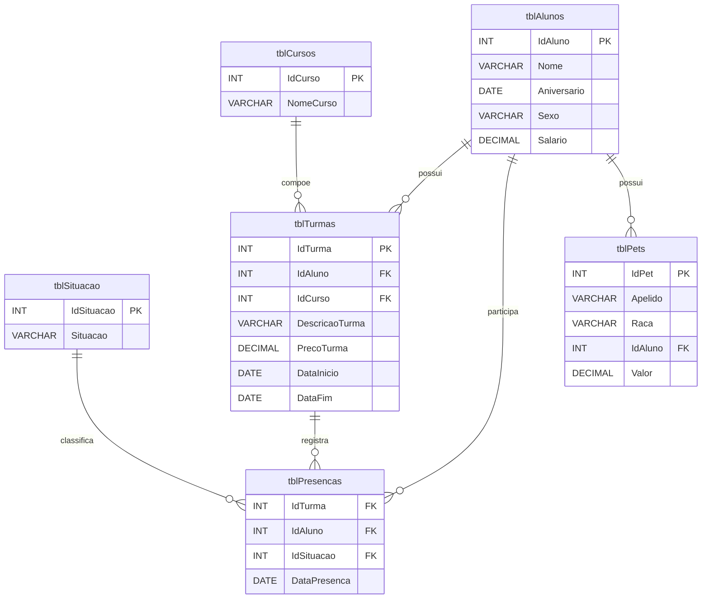

# Diagrama Entidade-Relacionamento — Exercício SQL

```mermaid
erDiagram

    tblAlunos {
        INT IdAluno PK
        VARCHAR Nome
        DATE Aniversario
        VARCHAR Sexo
        DECIMAL Salario
    }

    tblSituacao {
        INT IdSituacao PK
        VARCHAR Situacao
    }

    tblCursos {
        INT IdCurso PK
        VARCHAR NomeCurso
    }

    tblTurmas {
        INT IdTurma PK
        INT IdAluno FK
        INT IdCurso FK
        VARCHAR DescricaoTurma
        DECIMAL PrecoTurma
        DATE DataInicio
        DATE DataFim
    }

    tblPresencas {
        INT IdTurma FK
        INT IdAluno FK
        INT IdSituacao FK
        DATE DataPresenca
    }

    tblPets {
        INT IdPet PK
        VARCHAR Apelido
        VARCHAR Raca
        INT IdAluno FK
        DECIMAL Valor
    }

    tblAlunos   ||--o{ tblTurmas    : possui
    tblCursos   ||--o{ tblTurmas    : compoe
    tblTurmas   ||--o{ tblPresencas : registra
    tblAlunos   ||--o{ tblPresencas : participa
    tblSituacao ||--o{ tblPresencas : classifica
    tblAlunos   ||--o{ tblPets      : possui
```