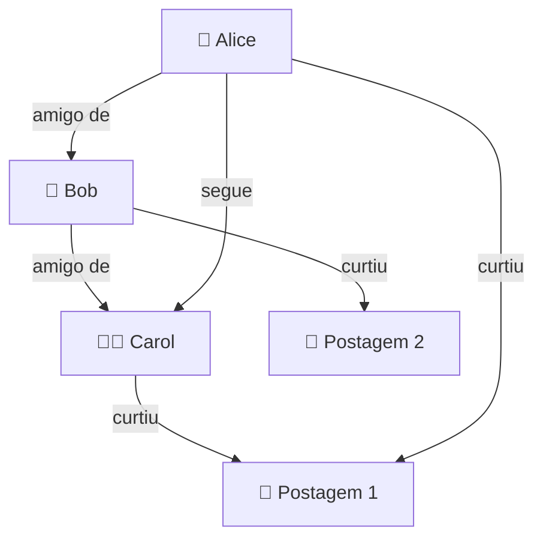
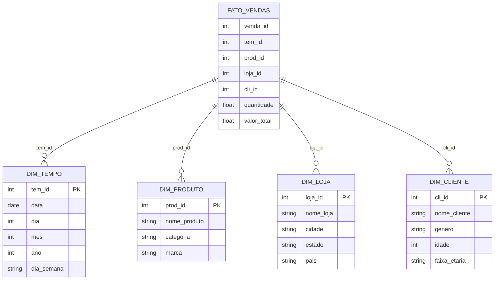
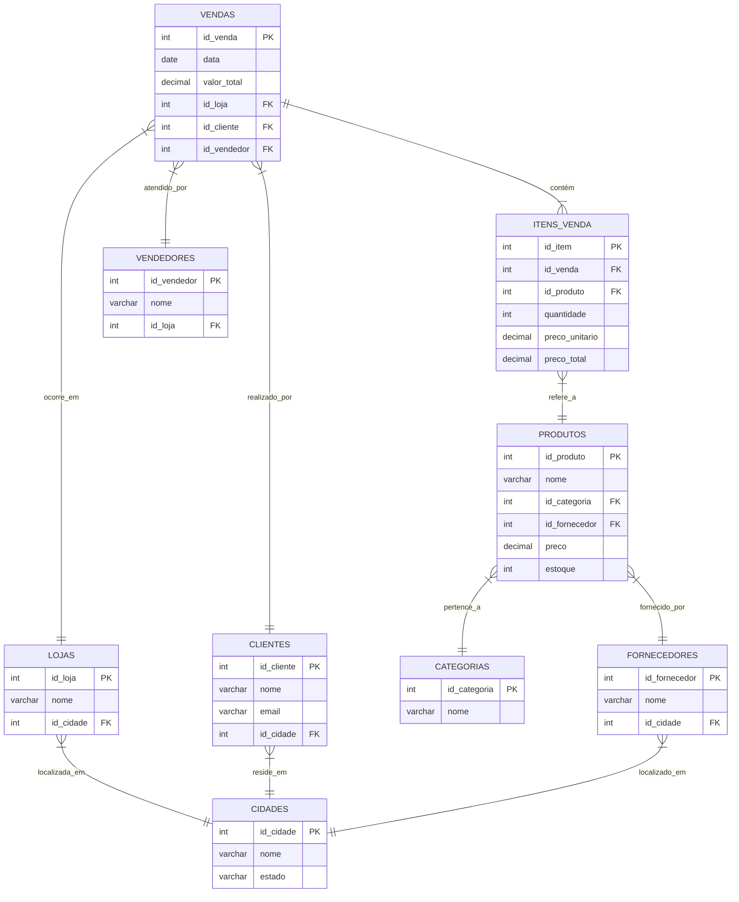
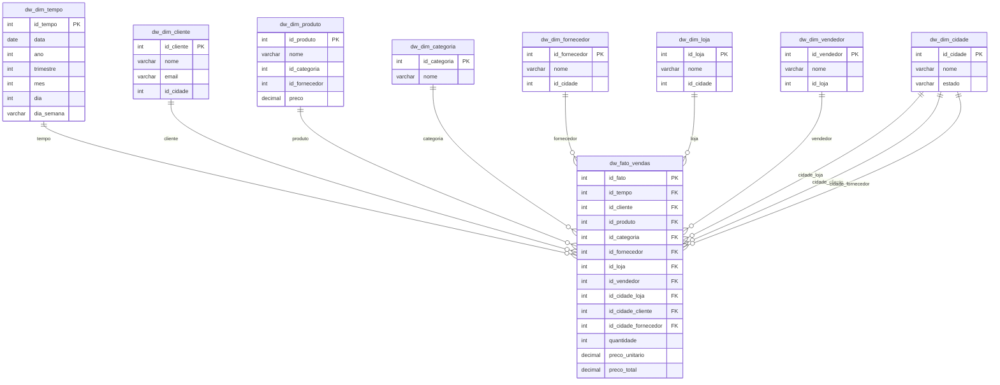
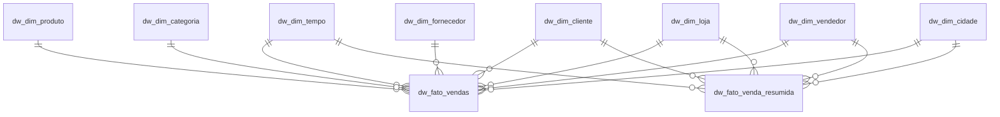
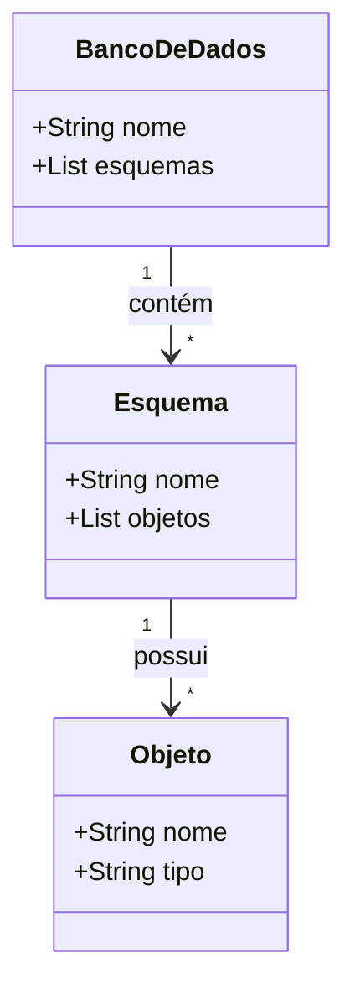
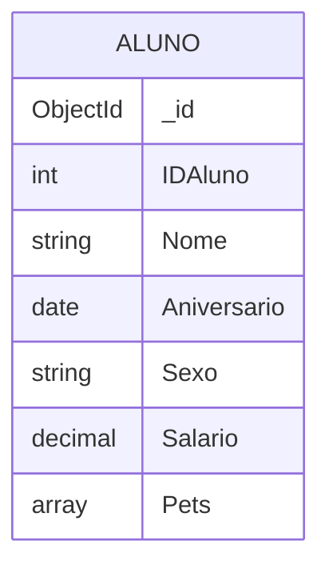
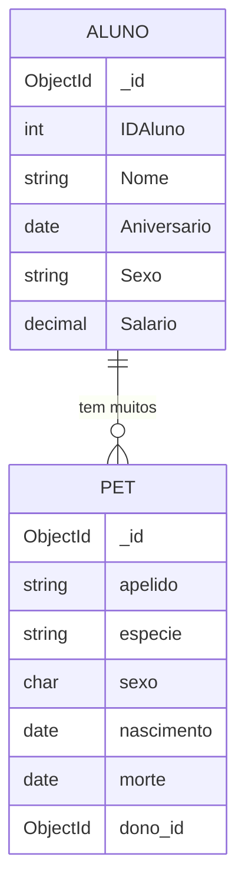
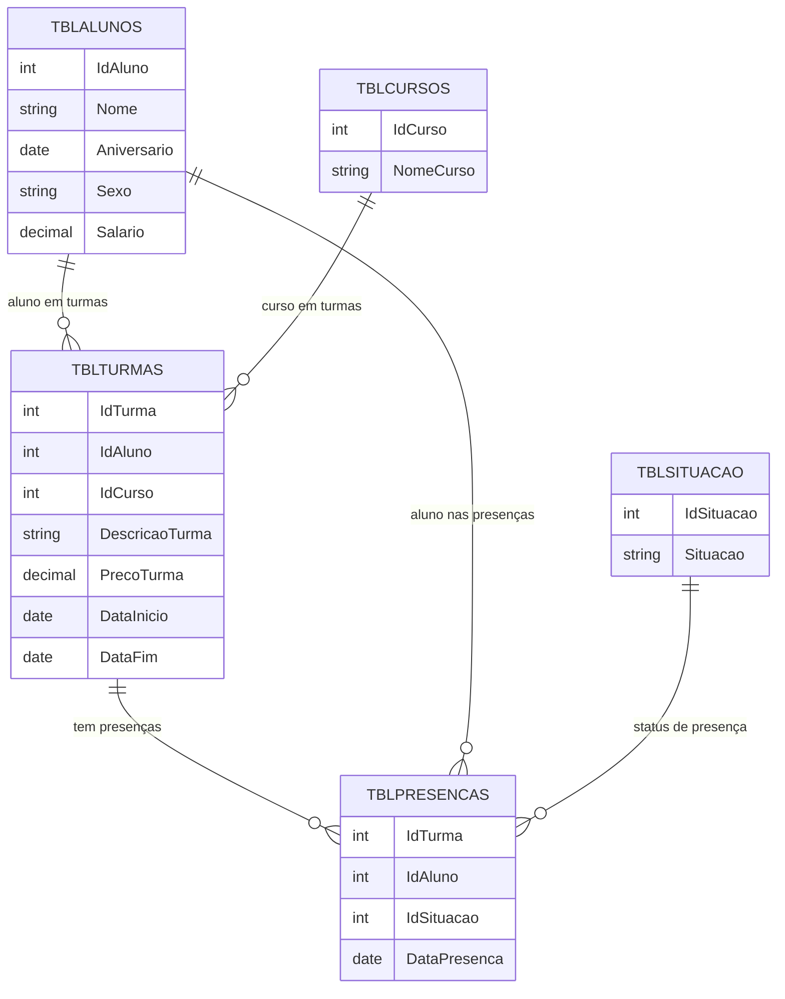
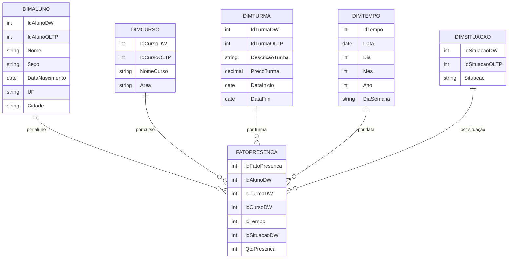

**Planos de curso Modelagem e Projeto de Banco de Dados**

* FACET-SNP-323 - MODELAGEM E PROJETO DE BANCO DE DADOS - T01 (2025.2 - 5N123)


- [:floppy\_disk: 1. Turma: Modelagem e Projeto de Banco de Dados](#floppy_disk-1-turma-modelagem-e-projeto-de-banco-de-dados)
  - [:watch: 1.1. Carga Horária Total: 60](#watch-11-carga-horária-total-60)
  - [:hourglass\_flowing\_sand: 1.2. Horário: 19hs - 22hs](#hourglass_flowing_sand-12-horário-19hs---22hs)
  - [:page\_with\_curl: 1.3. Ementa](#page_with_curl-13-ementa)
  - [:page\_with\_curl: 1.4. Metodologia](#page_with_curl-14-metodologia)
  - [:page\_with\_curl: 1.5. Procedimentos de avaliação de aprendizagem](#page_with_curl-15-procedimentos-de-avaliação-de-aprendizagem)
  - [:hourglass\_flowing\_sand: 1.6. Horário de atendimento](#hourglass_flowing_sand-16-horário-de-atendimento)
- [:globe\_with\_meridians: 2. Sites utilizados](#globe_with_meridians-2-sites-utilizados)
- [:abacus: 3. Repositórios de apoio](#abacus-3-repositórios-de-apoio)
- [:date: 4. Datas de aulas e conteúdo](#date-4-datas-de-aulas-e-conteúdo)
- [:date: 5. Unidades de avaliações](#date-5-unidades-de-avaliações)
- [:hammer\_and\_wrench: 6. Links para download de ferramentas](#hammer_and_wrench-6-links-para-download-de-ferramentas)
- [:books: 7. Livros](#books-7-livros)
- [:newspaper: 8. Artigos (referências bibliográficas complementares)](#newspaper-8-artigos-referências-bibliográficas-complementares)
- [:notebook: 9. Cursos gratuítos (opcionais)](#notebook-9-cursos-gratuítos-opcionais)
- [:green\_book: 10. Como estudar (dicas)](#green_book-10-como-estudar-dicas)
- [:family\_man\_woman\_girl\_boy: 11. Grupos no telegram](#family_man_woman_girl_boy-11-grupos-no-telegram)
- [:tv: 12. Videos recomendados (material opcional)](#tv-12-videos-recomendados-material-opcional)
- [:green\_book: 13. Exemplos de modelos](#green_book-13-exemplos-de-modelos)
  - [:green\_book: 13.1. Exemplo de gráfo](#green_book-131-exemplo-de-gráfo)
  - [:green\_book: 13.2. Exemplo de modelo estrela](#green_book-132-exemplo-de-modelo-estrela)
- [:alarm\_clock: 14. Carga horária de 15hs adicionais (remota/online)](#alarm_clock-14-carga-horária-de-15hs-adicionais-remotaonline)
  - [🎓 14.1. Playlist de Banco de Dados (15h)](#-141-playlist-de-banco-de-dados-15h)
  - [📄 14.2. Artigos Científicos Open Access sobre Banco de Dados](#-142-artigos-científicos-open-access-sobre-banco-de-dados)
- [:floppy\_disk: 15. Bancos de dados da fundação Apache](#floppy_disk-15-bancos-de-dados-da-fundação-apache)
- [:crystal\_ball: 16.  OLTP --\> OLAP](#crystal_ball-16--oltp----olap)
  - [:cd: 16.1. Banco OLTP](#cd-161-banco-oltp)
    - [:dvd: 16.1.1. Comandos SQL p/ OLTP](#dvd-1611-comandos-sql-p-oltp)
    - [:radio: 16.1.2. Diagrama ER OLTP](#radio-1612-diagrama-er-oltp)
  - [:pager: 16.2. Banco OLAP --\> DW](#pager-162-banco-olap----dw)
    - [:loop: 16.2.1. Diagram ER OLAP DW](#loop-1621-diagram-er-olap-dw)
    - [:mag: 16.2.2. Fatos resumidas](#mag-1622-fatos-resumidas)
- [🏦 17. Descrição do conteúdo de um banco no SQL Server](#-17-descrição-do-conteúdo-de-um-banco-no-sql-server)
- [18. Relação entre esquema e banco](#18-relação-entre-esquema-e-banco)
- [19. Modelagem com MongDB](#19-modelagem-com-mongdb)
- [20. Modelagem de OLTP para OLAP](#20-modelagem-de-oltp-para-olap)
  - [20.1. OLTP](#201-oltp)
  - [20.2. OLAP](#202-olap)
  - [💻 Ícones usados nesta página](#-ícones-usados-nesta-página)


---
## :floppy_disk: 1. Turma: Modelagem e Projeto de Banco de Dados

### :watch: 1.1. Carga Horária Total: 60

### :hourglass_flowing_sand: 1.2. Horário: 19hs - 22hs

### :page_with_curl: 1.3. Ementa

* Conceitos sistemas de gerenciamento de banco de dados;
* Níveis de arquiteturas de banco de dados; 
* Modelo Relacional: Conceitos;
* Restrições e Normalização; 
* Modelos de banco de dados não-relacional.

### :page_with_curl: 1.4. Metodologia

A disciplina será conduzida por meio de aulas expositivas e dialogadas, com apresentação estruturada de conceitos teóricos e práticos, incentivando a participação ativa dos estudantes por meio de questionamentos, discussões orientadas e resolução de exemplos aplicados.

Serão utilizados comentários e análises de casos reais, situações práticas e exemplos relacionados ao contexto profissional, incluindo a apresentação e discussão de produtos, ferramentas e tecnologias correlatas aos temas abordados na disciplina, visando aproximar o conteúdo acadêmico da realidade do mercado e da pesquisa aplicada.

As atividades poderão envolver demonstrações práticas, análise de materiais complementares e discussões coletivas, buscando consolidar a compreensão conceitual e o desenvolvimento do raciocínio crítico.

As aulas complementares, reposições ou atividades remotas (EaD) serão realizadas por meio de conteúdos disponibilizados na plataforma SIGAA e nos ambientes digitais da disciplina, incluindo leituras orientadas, vídeos, exercícios e atividades práticas, constituindo parte integrante do processo de aprendizagem. Os alunos devem como parte da carga horária EAD: trazer ferramentas e datasets previamente baixados e instalados.

###  :page_with_curl: 1.5. Procedimentos de avaliação de aprendizagem

Prova presencial escrita objetiva de múltipla escolha. Cálculo de notas por soma de pontos simples. Cada avaliação vale 10 pontos. São 3 avaliações. Resultado final via média simples entre avaliações. Excepcionalmente poderão ocorrer avaliações online. Poderão ocorrer atividades online objetivando fixação de conceitos (valendo pontos ou não).

Provas de 2ª chamada devem ser requisitas dentro do prazo e formalmente conforme regras da faculdade. A prova de 2ª chamada é discursiva, escrita (tipo canetão).

A [carga horária remota/EAD] será realizada via: a) leitura de artigos postados pelo professor (ou videos correlatos aos assuntos abordados em sala); b) exercícios disponíveis na plataforma EaD da instituição ou c) envio de trabalho, conforme o caso. Este material também poderá estar na sua avaliação presencial escrita. O material usado nas atividades EAD será disponibilizado no site do professor e na página da disciplina no SIGAA e no github.

A 1ª avaliação terá o conteúdo das aulas de 1 a 5.

A 2ª avaliação terá o conteúdo das aulas 6 a 10.

A 3ª avaliação terá o conteúdo das aulas 11 a 14 e os artigos selecionados.

Temos 15 encontros presenciais, sequênciais, 1 ves por semana; nos encontros 5, 10 e 15, teremos as avaliações.

Carga Horária Remota (EAD):

A carga horária remota (15 horas) será desenvolvida por meio de atividades orientadas de aprendizagem assíncrona, complementares às aulas presenciais, com o objetivo de aprofundar conceitos, promover autonomia acadêmica e preparar o estudante para as avaliações da disciplina.

As atividades EAD deverão ser realizadas pelos alunos ao longo do semestre, conforme cronograma disponibilizado pelo professor, podendo incluir:

a) Leitura orientada de artigos científicos e/ou materiais técnicos selecionados pelo professor, disponibilizados no SIGAA, site da disciplina ou repositório oficial no GitHub. Os conteúdos poderão ser discutidos em sala de aula e/ou cobrados nas avaliações presenciais.

b) Visualização de vídeos técnicos e aulas complementares indicados pelo professor, relacionados aos conteúdos abordados na disciplina, podendo ser objeto de discussão em aula e avaliação.

c) Instalação, configuração e utilização de ferramentas computacionais selecionadas pelo professor e disponibilizadas no repositório da disciplina no GitHub, com finalidade prática de experimentação dos conceitos estudados. O uso dessas ferramentas poderá ser solicitado em atividades presenciais e/ou avaliações.

d) Produção de atividades de consolidação da aprendizagem, tais como registros reflexivos, exercícios comentados, pequenos relatórios técnicos, participação em fóruns acadêmicos ou outras atividades orientadas na plataforma EaD da instituição, podendo ou não possuir atribuição de pontuação.

O material utilizado nas atividades EAD poderá compor o conteúdo das avaliações presenciais.

As atividades serão disponibilizadas por meio do SIGAA e repositório oficial da disciplina no GitHub, constituindo parte integrante da carga horária da disciplina.

Notas: Cada uma das três avaliações vale 0 à 10,0. A média final da disciplina é feita fazendo média aritmética simples entre as notas obtidas. O aluno será considerado aprovado se atingir média igual ou superior a 6,0. Alunos com nota >= 4,0 e < 6,0 têm direito à nota de exame final.

Prova final: (PF) ou exame final será aplicado após a avaliação 3. A avaliação poderá escrita objetiva (tipo canetão). O conteúdo será... TODO o conteúdo ministrado ao longo do semestre. A prova final deve ser requisitada na Secretaria Acadêmica.

A realização das atividades EAD constitui requisito para acompanhamento adequado da disciplina, sendo responsabilidade do estudante cumprir as orientações e prazos estabelecidos.


### :hourglass_flowing_sand: 1.6. Horário de atendimento

No dias de aula da disciplina. 30 minutos antes da aula (via agendamento prévio pelo sistema SIGAA).

---
## :globe_with_meridians: 2. Sites utilizados


|Sites utilizados|Url|
|-----|-----|
|Site do professor	| https://www.pontodeensino.com |
|Site das disciplinas | https://sites.google.com/unemat.br/professoremiliano |
|Sites das disciplinas no github | https://github.com/monteiro74/aulas_2025_1 |
|Sistema Acadêmico | https://sigaa.unemat.br/sigaa/verTelaLogin.do|
| Link Tree do curso | https://linktr.ee/si.unemat |
| Página do curso | https://sinop.unemat.br/faculdades/facet/graduacao/sistemas-de-informacao-bacharelado-graduacao-presencial-noturno-sinop |

---
## :abacus: 3. Repositórios de apoio

|Sites utilizados|Url|
|-----|-----|
| Resumo de diagramas para Engenharia de Software | https://github.com/monteiro74/diagramas_resumo  |
| Lista de ferramentas | https://github.com/monteiro74/lista_de_ferramentas |

---
## :date: 4. Datas de aulas e conteúdo


|Aula | Data   | Carga horária| Conteúdo |
|-----|--------|--------------|----------|
| 1   | 26/fev | 3hs | Apresentação da disciplina, conceitos básicos sobre bancos de dados, referências bibliográficas. [Ranking de bancos de dados](https://db-engines.com/en/ranking). [Slides da aula](https://docs.google.com/presentation/d/e/2PACX-1vSRYcBjWwaSQ7CtSO_JAYhzch5RD6ga9G37BJe7X2IA5WX_03s5LQ8MOfzO-O4LvEgoCimjHEp06skH/pub?start=false&loop=false&delayms=3000) |
| 2   | 05/mar | 3hs | Comparativo SGBD x Arquivo de dados. Níveis da arquitetura. Métodos de acesso. Processamento de software. [Slides da aula 2](https://docs.google.com/presentation/d/e/2PACX-1vQS7F9wsXhfxDK9lCwSeTAricxAnKKJh_Mbcyq-SnbOGEQTOAZ0W0q03xEGrMfWDuI_DP9dqAKZpeWv/pub?start=false&loop=false&delayms=3000). [Instalação do SQL Server](https://docs.google.com/presentation/d/e/2PACX-1vSdSRJF2YEI9D0U48sGimqfWDxzFlJJHfcFesiBrJyCKZ68K4RL5T70kBA_7TdwIqo6j1AVjOI3Z0xr/pub?start=false&loop=false&delayms=3000) |
| 3   | 12/mar  | 3hs | Instalação de máquina virtual (virtual box), detalhes do SQL Server. [Slides da aula 3](https://docs.google.com/presentation/d/e/2PACX-1vQSNWOafk6jdNL5Ib1tVpdrzGPMMlYYJ4dyXckRVVHl0xL9P0ygddjeIVJYN24w_Lx6dmyuAlSpccFD/pub?start=false&loop=false&delayms=3000). |
| 4   | 19/mar | 3hs |Instalação de VM. Logs. Trilhas de auditoria. Bloqueio e impasse. Intro. Modelo ER. [Slides da aula 4](https://docs.google.com/presentation/d/e/2PACX-1vRXdeXYCc-eCUPaNqAVpBJtYfxTDAHqVj9odY_-t1vNerSnlPQJ3SK79uTSt8117erAzD5U8Gr1GVSE/pub?start=false&loop=false&delayms=3000).  |
| 5   | 26/mar | 3hs | SQL Server, conceitos  |
|    | 2/abr |  | Não leitvo  |
| 6   | 9/abr | 3hs | **Avaliação 1** Detalhes do SQL Server. Conhecendo o SSMS. Monitorando o SQL Server e propriedades do servidor. Slides da aula 3.  |
| 7   | 16/abr | 3hs | Modelo ER, normalização. Slides de aula: [Aula7a](https://docs.google.com/presentation/d/10lRm8Kon3Bh5gfm6r4APW85mCpykz6TU1a3aZakL5PQ/edit?usp=view), [Aula7b](https://docs.google.com/presentation/d/1IwDIXhhlK5Q9B656jhx235p3q6b3w62EVCv50I6PCIY/edit?usp=view), [Aula7c](https://docs.google.com/presentation/d/17EOiqhcG-wvdQVgNXgN4hQdo_lfKfToCttmq_a38U7k/edit?usp=view). |
| 8   | 23/abr | 3hs | Joins no SQL Server. SQL Server, criação de tabelas, Modelo de dados relacional, SQL Joins no SQL Server.  [Conceitos de threads](https://docs.google.com/presentation/d/1l4k_crNSadEV4_fYzUbz3mIQYQaH4ldH8MQrv8DTmNg/edit?usp=view); [Fail over](https://docs.google.com/presentation/d/1qIOSXWxenNQOPgdPmeWePya8hhAgNfoiyC2QrD_Hap0/edit?usp=view); [Segurança](https://docs.google.com/presentation/d/1Ac94XDDPodd2cUxKbfVaul2LOPeK9TrFhuAe6Izq7HM/edit?usp=view); [ODBC](https://docs.google.com/presentation/d/1kaxpFJTPUf7j3CCNwoET3hIA18FRz0cHLat35zTCoUU/edit?usp=view); [PostgreSQL](https://docs.google.com/presentation/d/1rkoKYRQ3WwaJG9buAmgQdEnaZbPbtJdVm7HZmc-DJg0/edit?usp=view); [SQL Server, critografia](https://docs.google.com/presentation/d/1iNo7416MVcQ0a5UrMuE4_KcFS2d0dQlak8Xpf0zYaOA/edit?usp=view); [SQL Server, importar planilha do Excel](https://docs.google.com/presentation/d/1aEyQ75_E_rQxiP46D_UElVsNaqZNtzIO7WbRM3HoFrk/edit?usp=view); [SQL Server, Mail e ML](https://docs.google.com/presentation/d/1zFJWQ59dTGQaOpfAI1LwrlCjcsC1Him_4wGW4lfUnxU/edit?usp=view); [SQL Server, Migration Assistant](https://docs.google.com/presentation/d/1oXOL6Do6luRan129ovFBmHaujKm3GzM-FbtVMUqxrRk/edit?usp=view); [SQL Server, Profiler](https://docs.google.com/presentation/d/1BWIHdB_mJ0kOJVHYugCHa27qGhpRsqAfZ2izUEC8_7g/edit?usp=view)|
| 9   | 30/abr  | 3hs | Exercício mineradora: [slide 1](https://github.com/monteiro74/aulas_2025_2/blob/main/modelagem_e_projeto_bd/exercicio_mineradora/exercicio_mineradora1.JPG), [slide 2](https://github.com/monteiro74/aulas_2025_2/blob/main/modelagem_e_projeto_bd/exercicio_mineradora/exercicio_mineradora2.JPG), [slide 3](https://github.com/monteiro74/aulas_2025_2/blob/main/modelagem_e_projeto_bd/exercicio_mineradora/exercicio_mineradora3.JPG), [slide 4](https://github.com/monteiro74/aulas_2025_2/blob/main/modelagem_e_projeto_bd/exercicio_mineradora/exercicio_mineradora4.JPG). |
| 10  | 7/mai | 3hs | **Avaliação 2**. |
| 11  | 14/mai | 3hs | Blockchain. [Blockchain](https://docs.google.com/presentation/d/199hQRI61fPm_AdWyBmB8Kjzi0h5tGygUwicFHoYowRY/edit?usp=view),[Lab com Multichain](https://docs.google.com/presentation/d/1QQy3NviUofkljxXjBsskmZmS90hyXFIYoP5jdgxXA74/edit?usp=view). [HP BladeSystem c-Class enclosure](https://www.hp.com/ctg/Manual/c00815957.pdf), [HP blade system c7000](http://servidor-hp.com.co/netcomp/documentacion/hp-bladesystem-c7000-enclosure-servidor-manual-servidor-hp.com.co.pdf). |
| 12  | 21/mai  | 3hs | Blockchain, NoSQL e bancos distribuídos. [Bancos de dados distribuídos](https://docs.google.com/presentation/d/1w7q3YINjzry0bFyrpecR1zffFR8vpJSfk4L5h2lpAaY/edit?usp=view), [Bancos NoSQL](https://docs.google.com/presentation/d/1zAGhhg8T9bBb_wOhXX5PdU_6fxmzSqPW8-G60hf3AY4/edit?usp=view), [Multichain](https://docs.google.com/presentation/d/1kSaqKg_RuXaZXABxAd4Ta9mQWpnMIWVeR1sgGV-xbUs/edit?usp=view). |
| 13  | 28/mai | 3hs | [Vetoriais, Blockchain de 2ª camada, Blockchain no DB,  bancos multi modelo, tendências, artigos, FISCO BCOS, ML, permissões no MySQL](https://docs.google.com/presentation/d/1ZRj6Vkdgu4NvnNKtCDhAvmuKExzTtVoT-VZA2N0evw0/edit?usp=view), [OLTP para OLAP](https://docs.google.com/presentation/d/1gfw8mNNbFf6zYxsOkprSbM4ONYfYNtQNBtzeJ5N2c_k/edit?usp=view), [Modelagem MongoDB](https://docs.google.com/presentation/d/11JD0BFoLe8SIqiIsKvG-RlpYAZqT_ZWzUrXJlAkTOCE/edit?usp=view). |
| 14  | 11/jun | 3hs | Revisão para avaliação.|
| 15  | 18/jun | 3hs  | **Avaliação 3** |


## :date: 5. Unidades de avaliações

* Avaliação 1: __/__/2026.
* Avaliação 2: __/__/2026.
* Avaliação 3: __/__/2026.

---
## :hammer_and_wrench: 6. Links para download de ferramentas

1. [Laragon](https://laragon.org/download/)
2. [Heidi SQL](https://www.heidisql.com/download.php)
3. [MS Sql Server Express 2022](https://go.microsoft.com/fwlink/p/?linkid=2216019&clcid=0x416&culture=pt-br&country=br)
4. [MS Sql Server Management Studio](https://learn.microsoft.com/pt-br/sql/ssms/download-sql-server-management-studio-ssms?view=sql-server-ver16)
5. [Visual Studio Code](https://code.visualstudio.com/download)
6. [Github Desktop](https://desktop.github.com/download/)
7. [DBeaver Community](https://dbeaver.io/download/)
8. [CouchDB](https://couchdb.apache.org/)
9.  [MySQL Workbench](https://dev.mysql.com/downloads/workbench/)
10. [Postgresql](https://www.postgresql.org/download/windows/)
11. [SQL Server Migration Assistant (SSMA) for MySQL](https://www.microsoft.com/en-us/download/details.aspx?id=54257)
12. [PowerBI](https://www.microsoft.com/pt-br/download/details.aspx?id=58494)

MongoDB:

* [MongoDB Community Server](https://www.mongodb.com/try/download/community)<br>
* [MongoDB Compass](https://www.mongodb.com/try/download/compass)<br>
* [MongoDB Relational Migrator Download](https://www.mongodb.com/try/download/relational-migrator)<br>
* [Studio 3T Free for MongoDB](https://studio3t.com/free/)<br>


Ferramenta para pesquisa:  https://github.com/langchain-ai/local-deep-researcher


## :books: 7. Livros

* ELMASRI, Ramez; NAVATHE, Shamkant B. Sistemas de Banco de Dados. 6 a edição. Editora Addison, 2005.

* SILBERSCHATZ, Abraham; KORTH, Henry F.; SUDARSHAN, S. Sistema de banco de dados. Trad. Daniel Vieira. 6ed. Rio de Janeiro: Elsevier, 2012.
Este livro esta disponível na biblioteca online da Unemat em: https://integrada.minhabiblioteca.com.br/reader/books/9788595157552/epubcfi/6/2[%3Bvnd.vst.idref%3Dcover]!/4/2/2%4074:39

* DATE, Christopher J. Introdução a sistemas de bancos de dados. Elsevier Brasil, 2004.
Este livro esta disponível na biblioteca online da Unemat em: https://integrada.minhabiblioteca.com.br/reader/books/9788595154322/epubcfi/6/2[%3Bvnd.vst.idref%3Dcapa.xhtml]!/4/2/2/4%4074:84

* MEDEIROS, Marcelo. Banco de dados para sistemas de informação. Visual Books. 2006.

* SETZER, V. W., SILVA, F. S. C. Banco de dados: aprenda o que são, melhore seu conhecimento, construa os seus. São Paulo: Edgard Blücher, 2005.
Este livro esta disponível na biblioteca online da Unemat em: https://integrada.minhabiblioteca.com.br/#/books/9788521216520/recent

* MONTEIRO, Emiliano Soares. Projeto de sistemas e bancos de dados. Rio de Janeiro: Brasport, 2004. 321. ISBN: 8574521760.

Referências na biblioteca virtual:
[referências bibliográficas](https://docs.google.com/presentation/d/1StFHjTjcc9mpTTDoWmMHJibmx2n17o8FLwxMhHskXZo/view).


---
## :newspaper: 8. Artigos (referências bibliográficas complementares)

Diagrama Entidade-Relacionamento: uma ferramenta para modelagem de dados conceituais em Engenharia de Software
https://rsdjournal.org/index.php/rsd/article/download/17776/15626/221575

O uso da abordagem sistêmica na modelagem de banco de dados
https://www.aedb.br/seget/arquivos/artigos12/65416864.pdf

Uma proposta de aplicação de business intelligence no chão-de-fábrica
https://www.scielo.br/j/gp/a/ydtVGxxBtD65zcx4VmJDJGw/?format=pdf

Os desafios da administração pública na disponibilização de dados sensíveis
https://www.scielo.br/j/rdgv/a/GCMwrvnHzP4mJD3xZKNsnTq/?format=pdf

 


---


---
## :notebook: 9. Cursos gratuítos (opcionais)

* [Projeto Real DER (conceitual) com Banco de dados SQL SERVER](https://www.udemy.com/course/projeto-real-derconceitual-com-banco-de-dados-sql-server/)

* [Série DBA SQL Server - Preparação, instalação e configuração](https://www.udemy.com/course/sqlserver-instalacao-e-configuracao/)

* [Microsoft SQL for Beginners (SQL Server and T-SQL)](https://www.udemy.com/course/microsoft-sql-for-beginners-sql-server-and-t-sql/)

* [Introdução a banco de dados com MySQL & PHPMyAdmin](https://www.udemy.com/course/mysql_phpmyadmin/)

* [Introdução a Bancos de Dados e Linguagem SQL](https://www.udemy.com/course/introducao-a-bancos-de-dados-e-linguagem-sql/)

* [Como conectar com o SQL Server (Lesson 1: Connecting to the Database Engine)](https://learn.microsoft.com/en-us/sql/relational-databases/lesson-1-connecting-to-the-database-engine?view=sql-server-ver16)

* [Conectando e realizando consultas no SQL Server(Quickstart: Connect and query a SQL Server instance using SQL Server Management Studio (SSMS))](https://learn.microsoft.com/en-us/sql/ssms/quickstarts/ssms-connect-query-sql-server?view=sql-server-ver16)

* [Introdução à análise de dados da Microsoft](https://learn.microsoft.com/pt-br/training/powerplatform/power-bi).


---
## :green_book: 10. Como estudar (dicas)

3 técnicas indicadas por cientistas para qualquer pessoa melhorar nos estudos
https://www.youtube.com/watch?v=posTc56basM

As formas mais eficientes de estudar para prova
https://www.youtube.com/watch?v=1y0xBcGZJmk


---
## :family_man_woman_girl_boy: 11. Grupos no telegram


|Grupo | Link no Telegram |
| --- | --- |
| Vagas de TI para todos | https://t.me/vagastibr |
| Flutterflow Brasil | https://t.me/flutterflowbrazil |
| Bubble.ioBR | https://t.me/bubbleBR |
| Grupo de usuários Oracle Cloud Brasil | https://t.me/GUOCB |
| PHP Brasil | https://t.me/phpbrasil |
| Lazarus & Delphi Brasil | https://t.me/LazBrasil |
| Lazarus BR | https://t.me/LazarusBR | 
| MySQL BR | https://t.me/mysqlbr | 
| Python Brasil | https://linktr.ee/python.brasil | 
| C# Brasil | https://t.me/csharpbrasiloficial |
| Microsoft C#.Net | https://t.me/CSharpDevelopersBrasil |
| SQL Server GO | https://t.me/SQLServerGO |


---
## :tv: 12. Videos recomendados (material opcional)

1. ["NÃO PRECISAMOS MAIS DA TI" | FEBRABAN TECH 2024](https://www.youtube.com/watch?v=M-rlucvPG94)

2. [Scrum Master é um Inútil (não é só sobre isso)](https://www.youtube.com/watch?v=1eGSPUN0sj4)

3. [TIOZÃO DA FEBRABAN TEM RAZÃO](https://www.youtube.com/watch?v=Qjmmug9S3rI)

4. [De onde vem as boas ideias](https://www.youtube.com/watch?v=BtgnozUgc58)

5. [IA na Programação é um Caminho SEM VOLTA!](https://www.youtube.com/watch?v=d8cQn15P5TY)


---
## :green_book: 13. Exemplos de modelos

### :green_book: 13.1. Exemplo de gráfo



### :green_book: 13.2. Exemplo de modelo estrela




---
## :alarm_clock: 14. Carga horária de 15hs adicionais (remota/online)

Este curso tem 45 horas presenciais + 15 horas remotas, totalizando **60hs**.

### 🎓 14.1. Playlist de Banco de Dados (15h)


| Título                                                      | Tópico Principal            | Duração Estimada | URL   |
|-------------------------------------------------------------|--------------------|------------------|-------|
| Curso de Modelagem de Dados (Playlist)                      | Modelagem de dados | 3h 00min         | [Link](https://www.youtube.com/playlist?list=PLucm8g_ezqNoNHU8tjVeHmRGBFnjDIlxD) |
| Introdução à Modelagem de Dados                             | Modelagem de dados | 0h 20min         | [Link](https://www.youtube.com/watch?v=W49AO7f93Jk) |
| 8 Etapas para Modelagem de Dados                            | Modelagem de dados | 0h 30min         | [Link](https://www.youtube.com/watch?v=UZcaZD5VG0g) |
| Normalização de Dados em Bancos de Dados (1FN, 2FN, 3FN)    | Normalização       | 0h 15min         | [Link](https://www.youtube.com/watch?v=TOFZQ5wm1UI) |
| Banco de Dados - Normalização - Parte 1                     | Normalização       | 0h 20min         | [Link](https://www.youtube.com/watch?v=Mhd2bI5pJuo) |
| O que são as Formas Normais em Bancos de Dados?             |Normalização        | 0h 15min         | [Link](https://www.youtube.com/watch?v=Cj84bb04tio) |
| Como usar índices no Banco de Dados (SQL Server)            | Índices            | 0h 20min         | [Link](https://www.youtube.com/watch?v=j1n6NX11-G4) |
| A melhor explicação sobre índices que você já viu           | Índices            | 0h 25min         | [Link](https://www.youtube.com/watch?v=F5Ak31ToOjo) |
| Indexação em Banco de Dados                                 | Índices            | 0h 15min         | [Link](https://www.youtube.com/watch?v=Ujl67TEXRKs) |
| OLAP vs OLTP                                                | DW, OLTP, OLAP     | 0h 10min         | [Link](https://www.youtube.com/watch?v=iw-5kFzIdgY) |
| Data Warehouse Tutorial For Beginners                       | DW, OLTP, OLAP     | 1h 00min         | [Link](https://www.youtube.com/watch?v=J326LIUrZM8) |
| What is ETL  What is Data Warehouse  OLTP vs OLAP           | DW, OLTP, OLAP     | 0h 10min         | [Link](https://www.youtube.com/watch?v=oF_2uDb7DvQ) |
| Processamento de Transações / ACID - Bancos de Dados 2020.2 | Processamento, ACID, Concorrência  | 0h 40min | [Link](https://www.youtube.com/watch?v=EF4JoNoDnJw) |
| Entenda ACID, Concorrência e Como Garantir Consistência!    | Processamento, ACID, Concorrência  | 0h 20min | [Link](https://www.youtube.com/watch?v=txw4WrO7Azo) |
| Introdução ao Controle de Concorrência de Transações        | Processamento, ACID, Concorrência  | 0h 30min | [Link](https://www.youtube.com/watch?v=kycoQMqc0mc) |

**⏱️ Duração Total Estimada:** 14h 20min


### 📄 14.2. Artigos Científicos Open Access sobre Banco de Dados


| Título                | Tópico Principal | Estimativa de Leitura | URL               |
|-----------------------|---------|-----------------------|-------------------|
| Critical data modeling and the basic representation model | Modelagem de dados | 1h 30min | [Link](https://asistdl.onlinelibrary.wiley.com/doi/10.1002/asi.24745) |
| Data Modeling and Data Analytics: A Survey from a Big Data Perspective   | Modelagem de dados | 1h 30min | [Link](https://www.researchgate.net/publication/288872507_Data_Modeling_and_Data_Analytics_A_Survey_from_a_Big_Data_Perspective) |
| The Database Normalization Theory and the Theory of Normalized Systems: Finding a Common Ground  | Normalização | 1h 30min  | [Link](https://www.researchgate.net/publication/297731569_The_Database_Normalization_Theory_and_the_Theory_of_Normalized_Systems_Finding_a_Common_Ground) |
| Mastering database normalization: A comprehensive exploration of normal forms  | Normalização  | 1h 00min  | [Link](https://www.researchgate.net/publication/374509386_Mastering_database_normalization_A_comprehensive_exploration_of_normal_forms) |
| Guide to academic journal indexing: Where, when, and how to get indexed  | Índices | 1h 00min  | [Link](https://blog.scholasticahq.com/post/index-types-for-academic-journal/)  |
| Data warehousing, data mining, OLAP and OLTP technologies are essential elements to support decision-making process in industries | DW, OLTP e OLAP | 1h 30min  | [Link](https://www.researchgate.net/publication/50235148_DATA_WAREHOUSING_DATA_MINING_OLAP_AND_OLTP_TECHNOLOGIES_ARE_ESSENTIAL_ELEMENTS_TO_SUPPORT_DECISION-MAKING_PROCESS_IN_INDUSTRIES) |
| An Overview of Data Warehousing and OLAP Technology | DW, OLTP e OLAP | 1h 00min  | [Link](https://www.microsoft.com/en-us/research/wp-content/uploads/2016/02/sigrecord.pdf) |
| High-Performance ACID via Modular Concurrency Control  | Processamento de Transações, ACID e Concorrência  | 1h 30min   | [Link](https://www.cs.cornell.edu/lorenzo/papers/Chao15Callas.pdf) |
| Concurrency control methods in distributed database: A review and comparison | Processamento de Transações, ACID e Concorrência | 1h 30min  | [Link](https://www.researchgate.net/publication/319367720_Concurrency_control_methods_in_distributed_database_A_review_and_comparison) |
| A Survey on Transactional Stream Processing | Processamento de Transações, ACID e Concorrência  | 1h 30min  | [Link](https://arxiv.org/pdf/2208.09827) |

**⏱️ Duração Total Estimada de Leitura:** 15h 00min


## :floppy_disk: 15. Bancos de dados da fundação Apache


| Banco de Dados | Descrição                                                                                                             |
| -------------- | --------------------------------------------------------------------------------------------------------------------- |
| **Cassandra**  | Banco NoSQL distribuído, orientado a colunas, altamente escalável, ideal para grandes volumes e alta disponibilidade. |
| **HBase**      | Banco NoSQL distribuído baseado no Bigtable, roda sobre Hadoop/HDFS, focado em armazenamento de dados massivos.       |
| **Derby**      | Banco de dados relacional leve e embutido, 100% Java, ótimo para aplicações embarcadas.                               |
| **Hive**       | Data warehouse sobre Hadoop, permite consultas SQL-like em grandes conjuntos de dados distribuídos.                   |
| **CouchDB**    | Banco NoSQL orientado a documentos, com interface REST, replicação fácil e arquitetura tolerante a falhas.            |
| **Ignite**     | Banco de dados em memória (IMDG) distribuído, suporta SQL, alta performance e transações ACID.                        |
| **Accumulo**   | Banco NoSQL distribuído, baseado em Bigtable, com segurança em nível de célula e alta escalabilidade.                 |
| **Druid**      | Banco analítico distribuído, otimizado para OLAP e consultas rápidas em grandes volumes de dados.                     |
| **Solr**       | Motor de busca baseado no Lucene, pode ser usado como banco para consultas textuais complexas.                        |
| **Kudu**       | Banco colunar distribuído para análises em tempo real, integrado ao ecossistema Hadoop.                               |
| **Geode**      | Banco de dados em memória distribuído, baixa latência e processamento de dados em tempo real.                         |
| **Jackrabbit** | Repositório de conteúdo (JCR), utilizado para armazenamento estruturado e hierárquico de documentos.                  |


## :crystal_ball: 16.  OLTP --> OLAP

### :cd: 16.1. Banco OLTP

#### :dvd: 16.1.1. Comandos SQL p/ OLTP

```SQL

## Comandos SQL `CREATE TABLE` para MySQL

```sql
CREATE TABLE cidades (
    id_cidade INT PRIMARY KEY AUTO_INCREMENT,
    nome VARCHAR(100) NOT NULL,
    estado VARCHAR(2) NOT NULL
);

CREATE TABLE lojas (
    id_loja INT PRIMARY KEY AUTO_INCREMENT,
    nome VARCHAR(100) NOT NULL,
    id_cidade INT NOT NULL,
    FOREIGN KEY (id_cidade) REFERENCES cidades(id_cidade)
);

CREATE TABLE clientes (
    id_cliente INT PRIMARY KEY AUTO_INCREMENT,
    nome VARCHAR(100) NOT NULL,
    email VARCHAR(100),
    id_cidade INT NOT NULL,
    FOREIGN KEY (id_cidade) REFERENCES cidades(id_cidade)
);

CREATE TABLE fornecedores (
    id_fornecedor INT PRIMARY KEY AUTO_INCREMENT,
    nome VARCHAR(100) NOT NULL,
    id_cidade INT NOT NULL,
    FOREIGN KEY (id_cidade) REFERENCES cidades(id_cidade)
);

CREATE TABLE categorias (
    id_categoria INT PRIMARY KEY AUTO_INCREMENT,
    nome VARCHAR(100) NOT NULL
);

CREATE TABLE produtos (
    id_produto INT PRIMARY KEY AUTO_INCREMENT,
    nome VARCHAR(100) NOT NULL,
    id_categoria INT NOT NULL,
    id_fornecedor INT NOT NULL,
    preco DECIMAL(10,2) NOT NULL,
    estoque INT NOT NULL DEFAULT 0,
    FOREIGN KEY (id_categoria) REFERENCES categorias(id_categoria),
    FOREIGN KEY (id_fornecedor) REFERENCES fornecedores(id_fornecedor)
);

CREATE TABLE vendedores (
    id_vendedor INT PRIMARY KEY AUTO_INCREMENT,
    nome VARCHAR(100) NOT NULL,
    id_loja INT NOT NULL,
    FOREIGN KEY (id_loja) REFERENCES lojas(id_loja)
);

CREATE TABLE vendas (
    id_venda INT PRIMARY KEY AUTO_INCREMENT,
    data DATE NOT NULL,
    valor_total DECIMAL(12,2) NOT NULL,
    id_loja INT NOT NULL,
    id_cliente INT NOT NULL,
    id_vendedor INT NOT NULL,
    FOREIGN KEY (id_loja) REFERENCES lojas(id_loja),
    FOREIGN KEY (id_cliente) REFERENCES clientes(id_cliente),
    FOREIGN KEY (id_vendedor) REFERENCES vendedores(id_vendedor)
);

CREATE TABLE itens_venda (
    id_item INT PRIMARY KEY AUTO_INCREMENT,
    id_venda INT NOT NULL,
    id_produto INT NOT NULL,
    quantidade INT NOT NULL,
    preco_unitario DECIMAL(10,2) NOT NULL,
    preco_total DECIMAL(12,2) NOT NULL,
    FOREIGN KEY (id_venda) REFERENCES vendas(id_venda),
    FOREIGN KEY (id_produto) REFERENCES produtos(id_produto)
);

```

#### :radio: 16.1.2. Diagrama ER OLTP




### :pager: 16.2. Banco OLAP --> DW

#### :loop: 16.2.1. Diagram ER OLAP DW



#### :mag: 16.2.2. Fatos resumidas




---
## 🏦 17. Descrição do conteúdo de um banco no SQL Server


Explicação e exemplos dos objetos no banco de dados:

|Id| Item                        | Sub ítem                                          | Função principal              | Detalhes e exemplos                                                                 |
|--|-----------------------------|---------------------------------------------------|-------------------------------|-------------------------------------------------------------------------------------|
|  | **1. 📇 Diagramas de Banco de Dados** |                                         | Modelagem visual              | Criar e visualizar tabelas e relacionamentos em diagramas ER para documentação e manutenção. |
|  | **2. 🗃️ Tabelas**                    |                                         | Estruturas de dados           | Armazenam registros em linhas e colunas; podem ter chaves, restrições e índices.    |
|1 | Tabelas                              | 2.1. Tabelas do sistema                 | Metadados internos            | Guardam informações do próprio SQL Server, como `sys.tables`, `sys.objects`.        |
|2 | Tabelas                              | 2.2. FileTables                         | Armazenamento de arquivos     | Permitem gerenciar documentos do Windows diretamente no banco como tabelas.         |
|3 | Tabelas                              | 2.3. Tabelas Externas                               | Acesso a dados externos       | Representam dados fora do SQL Server (PolyBase, Big Data, Azure Blob).              |
|4 | Tabelas                              | 2.4. Tabelas de Grafo                                  | Modelagem de grafos           | Estruturas especiais para relacionar nós e arestas em grafos (ex.: redes sociais).  |
|5 | Tabelas                              | 2.5. Tabelas do Razão Descartadas                      | Consultas temporais           | Usadas com recursos de Temporal Tables para armazenar histórico de alterações.      |
|  | **3. 🗄️ Exibições (Views)**          |                                                   | Consultas virtuais            | Exibem dados derivados de tabelas, simplificando acesso e melhorando segurança.     |
|6| Exibições (Views)           | 3.1. Exibições do sistema                              | Metadados internos            | Views internas como `sys.views` que descrevem objetos de banco.                     |
|7| Exibições (Views)           | 3.2. Exibições do Razão Descartadas                    | Histórico temporal            | Usadas para representar estado de dados ao longo do tempo em tabelas temporais.     |
|| **4. 🛸 Recursos Externos**     |                                                   | Integração de fontes externas | Gerencia conexões para acessar dados fora do SQL Server.                            |
|8| Recursos Externos           | 4.1. Fontes de Dados Externos                          | Conectividade                 | Definem servidores, clusters ou serviços que fornecem dados externos.               |
|9| Recursos Externos           | 4.2. Formatos de Arquivos Externos                     | Definições de formato         | Especificam como ler arquivos externos (CSV, Parquet, ORC[Optimized Row Columnar]) pelo PolyBase.           |
|| **5. 📐Sinônimos**                   |                                                   | Apelidos para objetos         | Criam nomes alternativos para tabelas, views, procedures ou funções.                |
|| **6. 📦 Programação**        |                                                   | Lógica de negócio             | Agrupa objetos programáveis como procedures, funções e triggers.                    |
|10| Programação                 | 6.1. Procedimentos Armazenados                         | Automação de tarefas          | Rotinas SQL compiladas no banco (`sp_AtualizarEstoque`).                            |
|11| Programação                 | 6.2. Funções                                           | Cálculos reutilizáveis        | Retornam valores escalares ou tabelas (`fn_CalcularIdade`).                         |
|12| Programação                 | 6.3. Gatilhos de Bancos de Dados                       | Execução automática           | Disparam ações em eventos DML/DDL como INSERT, UPDATE, DELETE.                      |
|13| Programação                 | 6.4. Assemblies                                        | Integração com .NET           | Permitem rodar código CLR (Common Language Runtime em C#, VB.NET) dentro do SQL Server.                        |
|14| Programação                 | 6.5. Tipos                                             | Estruturas personalizadas     | Tipos de dados definidos pelo usuário (UDTs) e tipos de tabela.                     |
|15| Programação                 | 6.6. Regras                                            | Restrições antigas            | Definem regras de validação, hoje substituídas por CHECK constraints.               |
|16| Programação                 | 6.7. Padrões                                           | Valores padrão                | Definem valores default para colunas em tabelas.                                    |
|17| Programação                 | 6.8. Guias de Plano                                    | Otimização                    | Permitem forçar ou influenciar planos de execução de queries.                       |
|18| Programação                 | 6.9. Sequências                                        | Geração de valores            | Geram números sequenciais independentes de tabelas (como identity flexível).        |
|| **7. 🧾 Repositório de Consultas**    |                                                   | Monitoramento de queries      | Coleta histórico de execução para análise de performance.                           |
|19| Repositório de Consultas    | 7.1. Consultas regressadas                             | Diagnóstico                   | Identifica queries que ficaram mais lentas em comparação a execuções anteriores.    |
|20| Repositório de Consultas    | 7.2. Consumo Geral de Recursos                         | Análise de performance        | Exibe consultas que consomem mais CPU, memória e IO.                                |
|21| Repositório de Consultas    | 7.3. Principais Consultas de Consumo de Recursos       | Ranking de consumo            | Lista as queries mais pesadas do banco.                                             |
|22| Repositório de Consultas    | 7.4. Consultas com Planos Forçados                     | Controle de execução          | Mostra queries executadas com planos de execução forçados manualmente.              |
|23| Repositório de Consultas    | 7.5. Consultas com Variação Alta                       | Estabilidade                  | Aponta consultas com grande variação de desempenho entre execuções.                 |
|24| Repositório de Consultas    | 7.6. Estatísticas de Espera da Consulta                | Gargalos                      | Apresenta waits (bloqueios, IO, paralelismo) durante execuções.                     |
|25| Repositório de Consultas    | 7.7. Consultas Rastreadas                              | Auditoria                     | Exibe consultas específicas que foram monitoradas ou marcadas para rastreamento.    |
|| **8. 🏷️ Service Broker**     |                                                   | Mensageria assíncrona         | Gerencia troca de mensagens entre aplicações e bancos.                              |
|26| Service Broker              | 8.1. Tipos de Mensagem                                 | Estrutura de dados            | Definem formato das mensagens que podem ser enviadas.                               |
|27| Service Broker              | 8.2. Contratos                                         | Regras de comunicação         | Especificam que tipos de mensagens são aceitos em uma conversa.                     |
|28| Service Broker              | 8.3. Filas                                             | Armazenamento temporário      | Guardam mensagens até que sejam processadas.                                        |
|29| Service Broker              | 8.4. Serviços                                          | Pontos de comunicação         | Definem a lógica que processa mensagens de filas.                                   |
|30| Service Broker              | 8.5. Rotas                                             | Direcionamento                | Indicam para onde enviar mensagens em redes distribuídas.                           |
|31| Service Broker              | 8.6. Associações de Serviço Remoto                     | Conexões externas             | Estabelecem vínculo com serviços de outros servidores.                              |
|32| Service Broker              | 8.7. Prioridades do Agente                             | Qualidade de serviço          | Definem prioridades de processamento de mensagens.                                  |
|| **9. 📚Armazenamento**        |                                                   | Estruturas físicas            | Gerencia índices, partições, catálogos e outros objetos de armazenamento.           |
|33| Armazenamento               | 9.1. Catálogos de Texto Completo                       | Busca textual                 | Indexam textos para pesquisas com `CONTAINS` e `FREETEXT`.                          |
|34| Armazenamento               | 9.2. Esquemas de partição                              | Divisão lógica                | Organizam dados em múltiplas partições para desempenho e manutenção.                |
|35| Armazenamento               | 9.3. Funções de partição                               | Regras de distribuição        | Determinam como dados são distribuídos entre partições.                             |
|36| Armazenamento               | 9.4. Listas de palavras irrelevantes de texto completo | Otimização de pesquisa        | Palavras descartadas em buscas textuais (ex.: artigos como “a”, “o”, “de”).         |
|37| Armazenamento               | 9.5. Listas de propriedades de pesquisa                | Configuração                  | Definem propriedades adicionais para consultas de texto completo.                   |
|| **10. 👮‍♂️ Segurança**          |                                                   | Controle de acesso            | Gerencia autenticação, permissões e criptografia.                                   |
|38| Segurança                   | 10.1. Usuários                                          | Identidades                   | Representam contas de acesso a um banco específico.                                 |
|39| Segurança                   | 10.2. Funções                                           | Agrupamento de permissões     | Roles que reúnem permissões para simplificar administração.                         |
|40| Segurança                   | 10.3. Esquemas                                          | Organização lógica            | Agrupam objetos (tabelas, views, etc.) sob um namespace de segurança.               |
|41| Segurança                   | 10.4. Chaves Assimétricas                               | Criptografia                  | Usadas em assinaturas digitais e criptografia com chave pública/privada.            |
|42| Segurança                   | 10.5. Certificados                                      | Autenticação                  | Fornecem autenticação e podem proteger dados ou conexões.                           |
|43| Segurança                   | 10.6. Chaves Simétricas                                 | Criptografia                  | Usam a mesma chave para criptografar e descriptografar dados.                       |
|44| Segurança                   | 10.7. Chaves Always Encrypted                           | Proteção em trânsito          | Mantêm dados criptografados em colunas sensíveis, acessíveis apenas pelo cliente.   |
|45| Segurança                   | 10.8. Especificações de Auditoria de Bancos de Dados    | Auditoria                     | Registram acessos e alterações para fins de conformidade.                           |
|46| Segurança                   | 10.9. Políticas de Segurança                            | Regras avançadas              | Incluem Row-Level Security e Dynamic Data Masking para controle de acesso granular. |


## 18. Relação entre esquema e banco




---
## 19. Modelagem com MongDB

🅰️ Versão A – Embedding



🅱️ Versão B – Referencing




---
## 20. Modelagem de OLTP para OLAP


### 20.1. OLTP




### 20.2. OLAP




---
### 💻 [Ícones usados nesta página](https://github.com/ikatyang/emoji-cheat-sheet)

